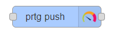
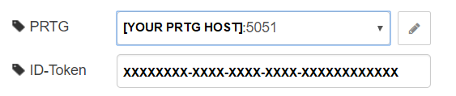
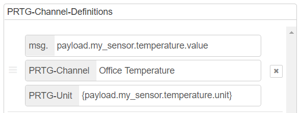

# node-red-contrib-prtg
node-red nodes to interact with PRTG Network Monitor

## Install:
    npm i git+https://github.com/PaesslerAG/node-red-contrib-prtg.git

## PRTG Nodes:

The prtg-connector node ingests a msg payload, transforms it to the PRTG Custom Sensor message format and sends an HTTP Post request to the configured PRTG Probe.
The address and ID-Token used for the HTTP Push Based Sensor of your PRTG-Probe needs to be configured.

## Configuration

**Here goes your server and port:**

**Here you need to add your ID-Token:**

**Example of PRTG-Channel-Definition:**

    msg.
        The path of your input message
    
    PRTG-Channel
        The name of your Channel in PRTG

    PRTG-Unit
        The custom unit name in PRTG
        (Can be a static string or a placeholder)

## Collaborate
### Commit message format:
    <type>(<scope>): <subject>

    types:

    *feat: A new feature
    *fix: A bug fix
    *docs: Documentation only changes
    *style: Changes that do not affect the meaning of the code (white-space, formatting, missing semi-colons, etc)
    *refactor: A code change that neither fixes a bug nor adds a feature
    *test: Adding missing or correcting existing tests
    *chore: Changes to the build process or auxiliary tools and libraries such as documentation generation

    As scopes we use the node-name or *

    Example: feat(prtg-connector): added a new field to the nodes settings

